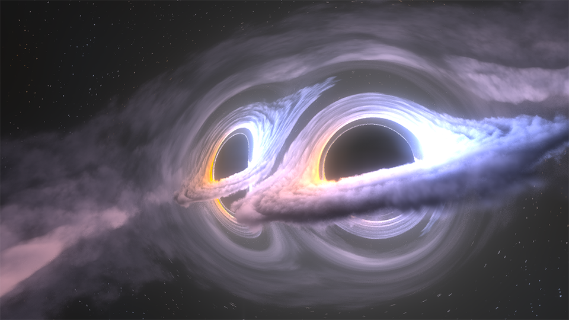

# VIRGO 1302 - Demoscene 4k Intro

This repo contains human readable source codes for [VIRGO 1302](https://www.pouet.net/prod.php?which=87087) [demoscene](https://en.wikipedia.org/wiki/Demoscene) 4k intro, and the build pipeline used to produce the final entry file. It placed 1st in [Assembly](https://www.assembly.org) 2020 4k intro competition. [You can view a prerendered version at YouTube](https://youtu.be/3Qc24vbfS44).

4k here doesn't stand for the video resolution which is 1080p, but rather the file size of the final result that is exactly 4096 bytes i.e. 4 kilobytes. The intro is a self-contained HTML page that produces 3:47 minute audio-visual presentation rendered real-time on GPU using Javascript and WebGL. Because it uses raymarching for rendering, it's quite heavy and needs powerful dedicated graphics card to run smoothly.

The name VIRGO 1302 comes from the [PKS-1302-102](https://en.wikipedia.org/wiki/PKS_1302-102) in Virgo constelation which is suspected to be a supermassive black hole binary.

The visuals are mainly inspired by a [simulation of twin blackholes done by Nasa](https://www.nasa.gov/feature/goddard/2018/new-simulation-sheds-light-on-spiraling-supermassive-black-holes) and the [whitepaper about rendering blackhole for the movie Interstellar](https://arxiv.org/abs/1502.03808).



# Technical overview

Music is done using [SoundBox](https://github.com/mbitsnbites/soundbox/). The player was then converted into producing only mono audio and heavily optimized, stripping all extra functionality. Song data is laid out in so similar parts are next to each other to further optimize compression.

Graphics are done using WebGL2, because it supports 3D textures that are necessary to render 3D shadow maps for proper volumetric lighting. Unfortunately compute shaders are only supported in experimental & beta builds of Chrome, so rendering shadow maps had to be with traditional fragment shaders layer by layer.

The scene is lit by 4 point lights slightly above and below the accretion disc of each black hole, simulating the light coming from the center. A single 128^3 3D shadow map is used, but it's divided into two parts to provide detailed shadow map to the center. First shadows are rendered for each point light and taking shorter steps near the center. Then these four 64x64x128 sections are merged into detailed shadow map 128x128x64 for the center and less detailed 128x128x64 shadow map for the outer clouds. This means evaluating the lighting can be done with a single texture lookup. World coordinates are also stretched to occupy full area of the shadow maps, so empty space doesn't take any space and nearly full 128^3 texture space is used. Temporal anti-aliasing is also heavily used to stabilize the shadows.

Black hole rendering tries to simulate all features of you could observe in a real black hole, but some artistic liberties are taken.
* Assymetry in gravity caused by rotation of the black hole, this leads to black hole being a bit "off center"
* Red and blushift in accretion disc caused by its rapid rotation around the black hole, the doppler effect
* Brigthening of the accresion disc also caused by rotation

Distortion of the light is achieved by raymarching from camera and applying gravity at each step based on distance traveled. Hybrid distance field and fixed length raymarching is used. While within volumetric cloud fixed step is used and while in empty space distance field with adaptive maximum step is used to still ensure high precision for gravity distortion. Gravity is modifed based on the angle of the ray in relation to rotation of the black hole to achieve the assymetry. Accretion disc color and brightness are also based on this angle.

The tails leaving the black holes and the larger cloud around the binary system mimic what can be seen in the Nasas simulation. This is simply a spiral texture with appropriate noises applied.

Main goal of the intro was to show of the gravity distortion, so accurate camera placement was necessary. This was achieved with key framed camera animation. Each keyframe is defined as 4D vector that tells distance to center, height, pan and tilt of the camera, then interpolating between these with smoothstep function.

# Prerequisites

Building requires:

* Windows
* Python 3
* Java 8 or higher

Zopflipng is available for other operating systems and Shader Minifier can most likely be ran through compatiblity layers, so Window isn't strictly required by the toolchain.

# Usage

If you don't already have `virtualenv` for Python already installed, you can install it with following command. It's recommended that you use it to keep your Python dependencies clean.

```sh
py -m pip install --user virtualenv
```

Next create a new environemnt for this project and activate it. To execute the virtualenv activation script, you need to allow it with Set-ExecutionPolicy for this PowerShelll session. Now the dependencies wont affect the global Python installation.

```sh
py -m venv env
Set-ExecutionPolicy Unrestricted -Scope Process
.\env\Scripts\activate
```

Now install the Python dependencies.

```sh
pip install -r requirements.txt
```

To build the final entry file just run the script.

```sh
python build.py
```

The resulting HTML file is under `entries/` folder and should be exactly 4096 bytes in size. The Python script and Zopflipng achieves 35 bytes better compression than just using off-the-shelf [JsExe](http://www.pouet.net/prod.php?which=59298). That's reduction from 4131 to 4096 bytes.

# Tools

Following tools are used by the compilation python script, they are included under tools/ folder.

* Google Closure Compiler
* Shader Minifier
* ZoplfliPNG

# Credits

* Bercon - Code, Graphics
* dixan - Music
* mbitsnbites - SoundBox